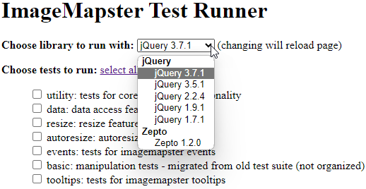

# ImageMapster: A jQuery Plugin to make image maps useful

[](LICENSE)
[](https://GitHub.com/jamietre/ImageMapster/releases/)
[](https://GitHub.com/jamietre/ImageMapster/releases/)
[](https://www.npmjs.com/package/imagemapster)
[](https://www.jsdelivr.com/package/npm/imagemapster)
[](https://cdnjs.com/libraries/imagemapster)
[](https://github.com/prettier/prettier)
[](https://github.com/jamietre/ImageMapster/actions/workflows/gh-pages-deploy.yml)

ImageMapster activates the areas in HTML image maps so you can highlight and select them. It has lots of other features for manual control, tooltips, resizing, and more. It is designed to be compatible with every common platform, and is tested with Internet Explorer 6-10, Firefox 3.0+, Safari, Opera, and Chrome. It works on mobile devices and doesn't use Flash.

## Documentation

Available on the [ImageMapster Website](https://jamietre.github.io/ImageMapster).

## Release Information

See the [change log](CHANGELOG.md) for details on the release history and roadmap.

## Find out More

See how to obtain [ImageMapster Support](SUPPORT.md).

## Contributing

See our [Contributing Guidelines](CONTRIBUTING.md).

## Development

The below covers the ImageMapster jQuery plugin. For information on how to develop the ImageMapster website, see its [README](site/README.md).

You can simultaneously make changes to both the plugin and the website by running `npm run dev` in both the plugin (./) and site (./site) directories. Any changes made to the plugin will be reflected in the site as its [imagemapster](./site/package.json#L16) dependency is linked to the root plugin package.

### Build

The source code is broken into several modules to make management easier and to make it possible to create feature-targeted builds. ImageMapster is built using grunt and can be invoked as follows:

1. Clone the repo
2. Install NPM dependencies - `npm install`
3. Generate a Build:
   - Debug Build (uncompressed) - `npm run build`
   - Release Build (uncompressed/compressed/sourcemap) - `npm run dist`

### Dev

1. Clone the repo
2. Install NPM dependencies - `npm install`
3. Run the dev task - `npm run dev`

### Tests

1. Clone the repo
2. Install NPM dependencies - `npm install`
3. Run the test task - `npm run test`

> ℹ️ **Note**
>
> By default, tests will run using the latest version of jQuery. The library to use when running tests can be changed via the dropdown.



### Examples

1. Clone the repo
2. Install NPM dependencies - `npm install`
3. Run the example task - `npm run example`

> ℹ️ **Note**
>
> By default, examples will run using jQuery. To run examples using Zepto, modify the examples HTML file (e.g., [USA](./examples/usa.html)) as follows, commenting out references to jQuery scripts and uncommenting references to zepto scripts.

```diff
...

+ <!--
  <script type="text/javascript" src="redist/jquery.3.7.1.min.js"></script>
  <script
    type="text/javascript"
    src="../dist/jquery.imagemapster.js"
  ></script>
+ -->
- <!-- <script type="text/javascript" src="redist/zepto.1.2.0.min.js"></script>
+ <script type="text/javascript" src="redist/zepto.1.2.0.min.js"></script>
  <script
    type="text/javascript"
    src="../dist/jquery.imagemapster.zepto.js"
- ></script> -->
+ ></script>

...
```

### Docs

> ℹ️ **Note**
>
> The docs have not been maintained and therefore are not under version control.

1. Clone the repo
2. Install NPM dependencies - `npm install`
3. Run the doc task - `npm run doc`

## License

Copyright © 2011-24 [James Treworgy](https://github.com/jamietre). Licensed under the [MIT License](LICENSE).
